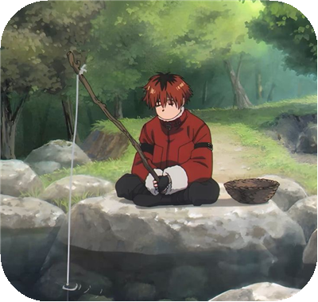

<table align="center">
  <tr>
    <td>
      
    </td>
    <td>
      <h1>¡Hola! Soy Joaquín Suárez Ramírez 👋</h1>
      
En el tiempo que llevo programando, he aprendido una gran lección:

      
<b>si funciona, mejor no tocarlo 😅🙏</b>

    </td>
  </tr>
</table>

---

## 🚀 Sobre mí

- ☕ Practicando **Java** (POO, patrón MVC) y **APIs con Spring Boot**
- ⚛️ Explorando **React + TypeScript** y desarrollo web
- 📱 Con base en **Kotlin y Android**
- 🌱 Siempre aprendiendo y construyendo proyectos nuevos

## 🛠️ Tecnologías

## 📂 Proyectos

### 👑 Proyecto estrella: TopCode

<table>
  <tr>
    <td width="120" align="center">
      
    </td>
    <td>
      <h3><a href="https://github.com/Haise232/TopCode">TopCode</a> 👑</h3>
      
La intranet académica para estudiantes de <b>DAM, DAW y ASIR</b>: actividades, calendario, apuntes, documentación en Markdown, foro de dudas, recursos y chat en tiempo real. Web + app móvil, con acceso aprobado por administradores y permisos por clase.

      

        
        
      

      

        
        
        
        
        
        
      

    </td>
  </tr>
</table>

### 🗂️ Todos los proyectos

| Proyecto | Tecnologías | Descripción |
|----------|-------------|-------------|
| 👑 **[TopCode](https://github.com/Haise232/TopCode)** | React, TypeScript, Expo, Supabase | **Intranet académica web + app móvil** · [demo](https://topcode-chi.vercel.app) |
| [Calculadora-React](https://github.com/Haise232/Calculadora-React) | React, TypeScript | Calculadora web |
| [rally-canarias](https://github.com/Haise232/rally-canarias) | HTML, CSS | Web sobre el Rally de Canarias |
| [Pokemon](https://github.com/Haise232/Pokemon) | HTML, CSS | Proyecto web de Pokémon |
| [Sistema de Biblioteca con MVC](https://github.com/Haise232/Act1.Ev-UT4.-Sistema-de-Biblioteca-con-MVC) | Java | Gestión de biblioteca con patrón MVC |
| [Sistema de Personajes de Videojuego](https://github.com/Haise232/Act3.Ev-UT4.-Sistema-de-Personajes-de-Videojuego) | Java | Personajes con programación orientada a objetos |
| [Gestor de Notas con Usuarios](https://github.com/Haise232/Act.Ev-UT5.2-Gestor-de-Notas-con-Usuarios) | Java | Gestor de notas con usuarios |
| [Sistema de Notas por Usuario](https://github.com/Haise232/Act.Ev-UT5.1-Sistema-de-Notas-por-Usuario) | Java | Notas asociadas a cada usuario |
| [Pedido de Restaurante](https://github.com/Haise232/Act.-4-Pedido-de-Restaurante) | Java | Gestión de pedidos de un restaurante |

## 📊 Estadísticas de GitHub

  
  

## 📫 Contacto

